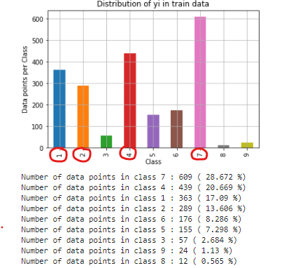
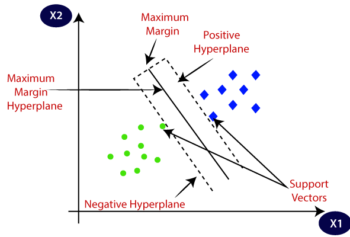

# Personalized Cancer Diagnosis <br>


## Software 

##### Jupyter Notebook &nbsp; 


## Packages 

##### 1) Pandas &nbsp; &nbsp;&nbsp;&nbsp;&nbsp;&nbsp;&nbsp;&nbsp;&nbsp;&nbsp;&nbsp;&nbsp;&nbsp;&nbsp;&nbsp;&nbsp;&nbsp;&nbsp;&nbsp;&nbsp;&nbsp;&nbsp;&nbsp;&nbsp;&nbsp; 5) NLTK

##### 2) Scipy &nbsp; &nbsp;&nbsp;&nbsp;&nbsp;&nbsp;&nbsp;&nbsp;&nbsp;&nbsp;&nbsp;&nbsp;&nbsp;&nbsp;&nbsp;&nbsp;&nbsp;&nbsp;&nbsp;&nbsp;&nbsp;&nbsp;&nbsp;&nbsp;&nbsp;&nbsp;&nbsp;&nbsp; 6) Numpy
##### 3) Sci-Kit Learn &nbsp;&nbsp;&nbsp;&nbsp;&nbsp;&nbsp;&nbsp;&nbsp;&nbsp;&nbsp;&nbsp;&nbsp;&nbsp;&nbsp;&nbsp;&nbsp;&nbsp;&nbsp; 7) Plotly
##### 4) Seaborn &nbsp;&nbsp;&nbsp;&nbsp;&nbsp;&nbsp;&nbsp;&nbsp;&nbsp;&nbsp;&nbsp;&nbsp;&nbsp;&nbsp;&nbsp;&nbsp;&nbsp;&nbsp;&nbsp;&nbsp;&nbsp;&nbsp;&nbsp;&nbsp; 8) Matplotlib
 

  
## Installation of Packages

- Open cmd and type the following commands: 

```bash
  pip3 install pandas
```
```bash
  pip3 install matplotlib
```
```bash
  pip3 install nltk
```
```bash
  pip3 install numpy
```
```bash
  pip3 install scipy
```
```bash
  pip3 install scikit-learn
```
```bash
  pip3 install seaborn
```
```bash
  pip3 install plotly
```

## Concepts Used

- Hyperparameter Tuning
- K-Nearest Neighbours
- Logistic Regression
- Exploratory Data Analysis
- Support Vector Machine
- Random Forest Classifier
- One Hot Encoding
- Response Encoding / Mean Value Replacement
- Naive Bayes
- Laplace Smooting

## Problem Overview

- Classify the given genetic variations/mutations based on evidence from text-based clinical literature.<br>
<b>Source:</b> https://www.kaggle.com/c/msk-redefining-cancer-treatment/</br>

- <b>We have two data files</b>: 
  #### 1) Containing the information about the Genetic Mutations.<br>
  #### 2) Containing the clinical evidence (text) that human experts/pathologists use to classify the Genetic Mutations.<br>

- Both these data files have a common column called ID <br>

- <b>Data file's information</b>:
  #### 1) training_variants (ID , Gene, Variations, Class)
  #### 2) training_text (ID, Text)

- There are 9 different classes a genetic mutation can be classified into => <b>Multi class classification problem</b>

- Performance Metric(s) to be used:
  #### 1) Multi class log-loss
  #### 2) Confusion matrix

## Objective & Constraints
- Objective: Predict the probability of each data-point belonging to each of the nine classes.
- Constraints:
  1) Interpretability 
  2) Class probabilities are needed. 
  3) Penalize the errors in class probabilites => Metric is Log-loss.
  4) No Latency constraints.
  
 ## Workflow Analysis
 
 ### Step 1
 
1) Reading Gene and Variation Data

  
2) Reading Text Data


3) Preprocessing of Text


4) Splitting the Data into Train, Test and Cross Validation (64:20:16)


<br>
Clearly Classes 1, 2, 4 and 7 have more number of data points. This distribution of points will determine how our models will likely work.

 ### Step 2
 
1) Prediction using a Random Model


<br>
This Random Model acts as a Threshold for other Models i.e. we should try to keep the other Model's Log-Loss value below that of Random Model!!

### Step 3

1) Univariate Analysis<br><br>
Uni means one and variate means variable, so in univariate analysis, there is only one dependable variable. The objective of univariate analysis is to derive the data, 
define and summarize it, and analyze the pattern present in it. In a dataset, it explores each variable separately. 
It is possible for two kinds of variables- Categorical and Numerical.<br>

We do the Univariate Analysis on 3 Features:
#### i) Gene (Categorical Variable)
<br>
#### ii) Variation (Categorical Variable)
<br>
#### iii) Text Feature (Words)
<br><br>

2) Stacking The Three Types of Features<br>


### Step 4

1) Machine Learning Models

#### I) Naive Bayes


#### My Output:<br>
  

#### II) K Nearest Neighbour


#### My Output:<br>

  

#### III) Logistic Regression with Class Balancing


#### My Output:<br>

  

#### IV) Logistic Regression without Class Balancing

#### My Output:<br>

  

#### V) Linear Support Vector Machine



#### My Output:<br>

  

#### VI) Random Forest Classifier


#### My Output:<br>


## Summarized Log-Losses and Misclassified Points <br>

  <br>
Logistic Regression with Class Balancing using One Hot Encoding gave the least Misclassified Points Percentage out of all the other models!!<br><br>

 <br>
Even though Voting Classifier which uses a Combination of Naive Bayes, Linear Regression and Support Vector Machine gave the least Misclassified Points Percentage out of all
the Models. However, it's Interpretability is almost Negligible, and therefore not recommended.


## References & Resources

- https://machinelearningknowledge.ai/k-nearest-neighbor-classification-simple-explanation-beginners/
- https://towardsdatascience.com/choosing-the-right-encoding-method-label-vs-onehot-encoder-a4434493149b
- https://www.analyticsvidhya.com/blog/2021/04/exploratory-analysis-using-univariate-bivariate-and-multivariate-analysis-techniques/
- https://machinelearningmastery.com/why-one-hot-encode-data-in-machine-learning/
- https://www.datacamp.com/community/tutorials/categorical-data
- https://www.ibm.com/cloud/learn/exploratory-data-analysis
- https://www.geeksforgeeks.org/introduction-to-support-vector-machines-svm/
- https://towardsdatascience.com/introduction-to-data-analysis-basic-concepts-involved-in-multivariate-analysis-4295cc125052
- https://www.section.io/engineering-education/introduction-to-random-forest-in-machine-learning/
- https://www.kaggle.com/dansbecker/what-is-log-loss
- https://www.cs.princeton.edu/courses/archive/spring16/cos495/slides/ML_basics_lecture7_multiclass.pdf
- https://towardsdatascience.com/intuition-behind-log-loss-score-4e0c9979680a
- https://www.javatpoint.com/machine-learning-random-forest-algorithm
- https://www.forbes.com/sites/matthewherper/2017/06/03/a-new-cancer-drug-helped-almost-everyone-who-took-it-almost-heres-what-it-teaches-us/#2a44ee2f6b25
- https://www.youtube.com/watch?v=qxXRKVompI8
